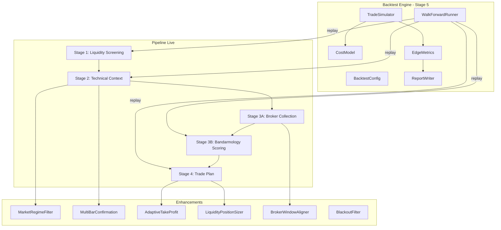
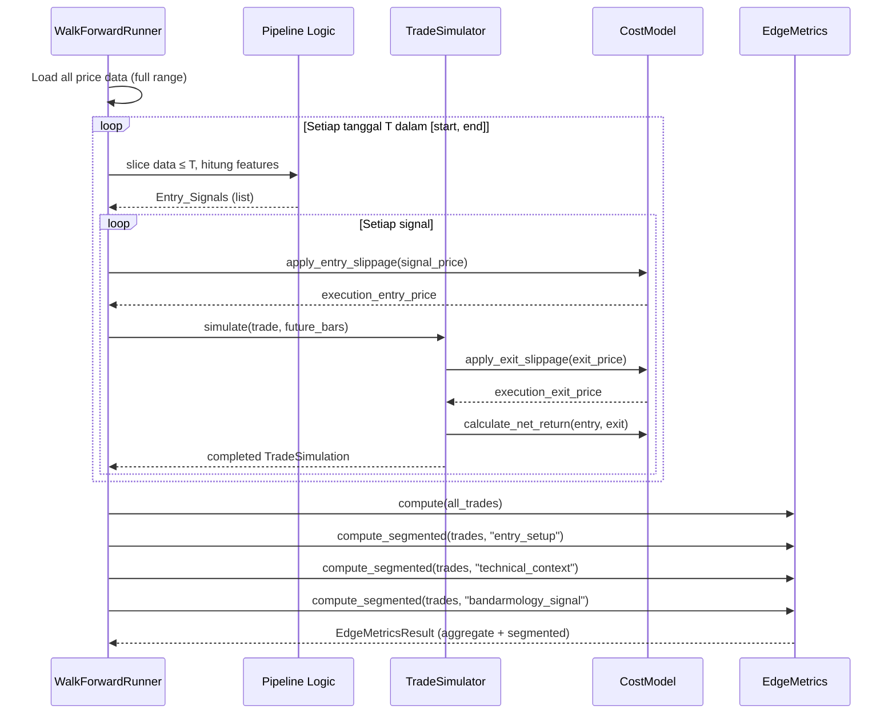

# Design Document: Trading Pipeline Edge Enhancement

## Overview

Dokumen desain ini menjelaskan arsitektur dan komponen teknis untuk peningkatan edge pada pipeline screening interday IDX. Peningkatan utama mencakup:

1. **Backtest Engine (Stage 5)** — simulasi walk-forward historis yang me-replay pipeline day-by-day tanpa mengubah perilaku live-screening.
2. **Cost & Slippage Model** — memodelkan fee transaksi IDX dan slippage realistis pada setiap trade simulation.
3. **Segmented Edge Metrics** — pelaporan metrik edge yang dipecah per dimensi sinyal.
4. **Bandarmology Scoring Enhancement** — penambahan kontribusi HHI, Top3 Dominance, dan Close vs Top Buyer Avg.
5. **Market Regime Filter** — gerbang opsional berbasis tren IHSG / breadth.
6. **Multi-bar Confirmation** — konfirmasi breakout/rebound lintas beberapa bar.
7. **Adjusted Close** — dual-price (adjusted untuk indikator, raw untuk tick validation).
8. **Adaptive Take-Profit** — TP berbasis ATR dan/atau resistensi.
9. **Liquidity-Capped Position Sizing** — pembatasan posisi berdasarkan avg_value_20d.
10. **Broker Window Alignment** — sinkronisasi waktu window broker dengan Stage 2.
11. **Dead Config Cleanup** — menerapkan atau menghapus parameter config mati.
12. **Earnings/Corporate Action Blackout** — jendela blackout di sekitar tanggal earnings.

### Keputusan Desain Kunci

| Keputusan | Rasional |
|-----------|----------|
| Backtest Engine sebagai modul terpisah (`backtest/`) | Agar pipeline live tidak terpengaruh; backtest me-*replay* fungsi yang sama. |
| Dual-price column (`adjusted_close` + `close` raw) | `auto_adjust=False` sudah ada di `fetch_ohlcv_history`; kita menambah kolom adjusted untuk kalkulasi indikator. |
| Bandarmology scoring additive (backward-compatible) | Field lama tetap, kontribusi baru ditambahkan di atas skor existing tanpa mengubah signature fungsi. |
| Market regime sebagai gate opsional (flag config) | Trader bisa toggle on/off; default ON setelah backtest membuktikan edge. |
| ATR-based adaptive TP dengan clamp | Menjaga target realistis dan tetap di tick IDX yang valid. |

---

## Architecture

### Diagram Arsitektur Tingkat Tinggi



### Struktur Direktori Baru

```
src/interday_liquidity_screener/
├── backtest/
│   ├── __init__.py
│   ├── config.py          # BacktestConfig, CostModelConfig
│   ├── runner.py           # WalkForwardRunner
│   ├── simulator.py        # TradeSimulator, Exit logic
│   ├── cost_model.py       # CostModel (fee + slippage + tick)
│   ├── metrics.py          # EdgeMetrics, SegmentedMetrics
│   └── report.py           # CSV/report writer
├── enhancements/
│   ├── __init__.py
│   ├── market_regime.py    # MarketRegimeFilter
│   ├── multibar_confirm.py # MultiBarConfirmation
│   ├── adaptive_tp.py      # AdaptiveTakeProfit
│   ├── liquidity_sizer.py  # LiquidityPositionSizer
│   ├── broker_window.py    # BrokerWindowAligner
│   └── blackout.py         # BlackoutFilter
├── adjusted_price.py       # Dual-price logic (adjusted + raw)
├── bandarmology.py         # Enhanced scoring (HHI, Top3Dom, CloseVsBuyer)
├── ... (existing modules unchanged)
```

---

## Components and Interfaces

### 1. BacktestConfig & CostModelConfig

```python
@dataclass(frozen=True)
class CostModelConfig:
    fee_buy_pct: float = 0.0015       # 0.15% default IDX fee beli
    fee_sell_pct: float = 0.0025      # 0.25% default IDX fee jual (termasuk pajak)
    slippage_pct: float = 0.001       # 0.1% slippage default
    snap_to_tick: bool = True         # Apakah harga hasil slippage harus valid tick

@dataclass(frozen=True)
class BacktestConfig:
    start_date: str                    # Format YYYY-MM-DD
    end_date: str                      # Format YYYY-MM-DD
    universe_tickers: list[str]        # Ticker universe
    time_stop_days: int = 10           # Default time-stop
    cost_model: CostModelConfig = field(default_factory=CostModelConfig)
    min_sample_size: int = 30          # Minimum sampel untuk signifikansi statistik
    warmup_days: int = 200             # Hari data minimum sebelum sinyal pertama
    output_dir: str = "data/output/backtest"
```

### 2. WalkForwardRunner

Komponen utama yang mengiterasi setiap hari perdagangan dalam rentang backtest dan memanggil pipeline logic untuk menghasilkan sinyal.

```python
class WalkForwardRunner:
    """Iterate tanggal keputusan, generate Entry_Signal, serahkan ke TradeSimulator."""

    def __init__(self, config: BacktestConfig, price_data: dict[str, pd.DataFrame]):
        ...

    def run(self) -> TradeLedger:
        """
        Untuk setiap tanggal T dalam [start_date, end_date]:
          1. Slice price_data sampai T (walk-forward constraint)
          2. Jalankan pipeline logic (technical features, entry setup, trade plan)
          3. Untuk setiap Entry_Signal, buat TradeSimulation
          4. Simulasikan exit menggunakan data setelah T
        Return: TradeLedger berisi semua TradeSimulation
        """
        ...

    def _slice_up_to(self, df: pd.DataFrame, date: pd.Timestamp) -> pd.DataFrame:
        """Slice DataFrame hanya sampai tanggal T (inclusive)."""
        return df[df.index <= date]

    def _has_sufficient_data(self, df: pd.DataFrame, min_points: int = 200) -> bool:
        """Cek apakah data cukup untuk hitung indikator."""
        ...
```

### 3. TradeSimulator

```python
@dataclass
class TradeSimulation:
    ticker: str
    entry_date: pd.Timestamp
    entry_price: float          # Harga setelah slippage
    raw_entry_price: float      # Harga sinyal asli
    stop_loss: float
    take_profit_1: float
    take_profit_2: float
    exit_date: pd.Timestamp | None = None
    exit_price: float | None = None
    exit_event: str | None = None   # "TP1_HIT", "SL_HIT", "TIME_STOP"
    return_gross: float | None = None
    return_net: float | None = None
    r_multiple: float | None = None
    mfe: float | None = None
    mae: float | None = None
    holding_days: int | None = None
    entry_setup: str | None = None
    technical_context: str | None = None
    bandarmology_signal: str | None = None

class TradeSimulator:
    """Simulasi satu trade dari entry sampai exit."""

    def __init__(self, cost_model: CostModel):
        ...

    def simulate(self, trade: TradeSimulation, future_bars: pd.DataFrame) -> TradeSimulation:
        """
        Evaluasi bar demi bar:
          - Cek apakah low <= stop_loss (SL hit)
          - Cek apakah high >= take_profit_1 (TP1 hit)
          - Jika keduanya terpenuhi pada bar yang sama -> pilih SL (konservatif)
          - Jika time_stop tercapai -> exit di close bar terakhir
        Hitung MFE, MAE, return_gross, return_net, r_multiple.
        """
        ...
```

### 4. CostModel

```python
class CostModel:
    """Terapkan fee dan slippage pada harga eksekusi."""

    def __init__(self, config: CostModelConfig):
        ...

    def apply_entry_slippage(self, signal_price: float) -> float:
        """Entry price = signal_price * (1 + slippage_pct), rounded ke tick terdekat (ceil)."""
        ...

    def apply_exit_slippage(self, signal_price: float) -> float:
        """Exit price = signal_price * (1 - slippage_pct), rounded ke tick terdekat (floor)."""
        ...

    def calculate_net_return(self, entry_price: float, exit_price: float) -> float:
        """return_net = (exit/entry - 1) - fee_buy_pct - fee_sell_pct"""
        ...

    def snap_price_to_tick(self, price: float, mode: str = "nearest") -> float:
        """Gunakan round_price_to_tick dari trade_plan.py."""
        ...
```

### 5. EdgeMetrics & SegmentedMetrics

```python
@dataclass
class EdgeMetricsResult:
    total_trades: int
    win_rate: float
    avg_win: float
    avg_loss: float
    expectancy: float           # (win_rate * avg_win) - (loss_rate * avg_loss)
    tp_hit_ratio: float         # TP exits / total exits
    sl_hit_ratio: float
    time_stop_ratio: float
    avg_holding_days: float
    mfe_median: float
    mfe_p25: float
    mfe_p75: float
    mae_median: float
    mae_p25: float
    mae_p75: float
    is_statistically_significant: bool
    sample_size: int

class EdgeMetrics:
    """Hitung metrik edge dari TradeLedger."""

    def __init__(self, min_sample_size: int = 30):
        ...

    def compute(self, trades: list[TradeSimulation]) -> EdgeMetricsResult:
        """Hitung semua metrik agregat."""
        ...

    def compute_segmented(
        self, trades: list[TradeSimulation], segment_key: str
    ) -> dict[str, EdgeMetricsResult]:
        """Pecah trades per segment_key, hitung metrik masing-masing."""
        ...
```

### 6. MarketRegimeFilter

```python
@dataclass(frozen=True)
class MarketRegimeConfig:
    enabled: bool = True
    ihsg_ticker: str = "^JKSE"
    ihsg_ma_period: int = 50
    breadth_ma_period: int = 50
    breadth_threshold: float = 0.50   # % saham di atas MA50
    regime_lookback_days: int = 5     # Jumlah hari untuk konfirmasi tren

class MarketRegimeFilter:
    """Evaluasi apakah pasar dalam kondisi risk-on."""

    def __init__(self, config: MarketRegimeConfig):
        ...

    def evaluate(self, ihsg_data: pd.DataFrame, universe_data: dict[str, pd.DataFrame],
                 decision_date: pd.Timestamp) -> MarketRegimeResult:
        """
        Return regime: RISK_ON, RISK_OFF, AMBIGUOUS.
        Hanya menggunakan data sampai decision_date.
        """
        ...

@dataclass
class MarketRegimeResult:
    regime: str                 # "RISK_ON", "RISK_OFF", "AMBIGUOUS"
    ihsg_above_ma: bool
    breadth_pct: float
    decision_date: pd.Timestamp
```

### 7. MultiBarConfirmation

```python
@dataclass(frozen=True)
class MultiBarConfig:
    breakout_confirm_bars: int = 2    # Default 2 bar konfirmasi breakout
    rebound_confirm_bars: int = 2     # Default 2 bar konfirmasi rebound

class MultiBarConfirmation:
    """Konfirmasi setup lintas beberapa bar."""

    def __init__(self, config: MultiBarConfig):
        ...

    def is_breakout_confirmed(self, features_history: pd.DataFrame,
                               decision_date: pd.Timestamp) -> bool:
        """
        Cek apakah N bar terakhir (sampai decision_date) konsisten
        memenuhi kriteria breakout:
        - close >= high_20d * 0.97
        - close_location >= 0.55
        """
        ...

    def is_rebound_confirmed(self, features_history: pd.DataFrame,
                              decision_date: pd.Timestamp) -> bool:
        """
        Cek apakah N bar terakhir memenuhi kriteria rebound:
        - distance_from_20d_low <= 0.10
        - close_location >= 0.55 ATAU return_1d > 0
        """
        ...

    def get_confirmation_status(self, setup: str, features_history: pd.DataFrame,
                                 decision_date: pd.Timestamp) -> str:
        """Return: 'CONFIRMED', 'PENDING_CONFIRMATION', atau 'NOT_APPLICABLE'."""
        ...
```

### 8. AdaptiveTakeProfit

```python
@dataclass(frozen=True)
class AdaptiveTPConfig:
    mode: str = "adaptive"        # "adaptive" atau "fixed"
    tp1_atr_multiple: float = 1.5
    tp2_atr_multiple: float = 2.5
    min_tp1_atr_multiple: float = 0.5   # Floor: entry + 0.5×ATR
    min_tp2_atr_multiple: float = 1.0   # Floor: entry + 1.0×ATR
    max_tp_pct: float = 0.12       # Ceiling 12%
    min_tp1_pct: float = 0.02      # Floor 2%
    fixed_tp1_pct: float = 0.05    # Fallback fixed mode
    fixed_tp2_pct: float = 0.08    # Fallback fixed mode

class AdaptiveTakeProfit:
    """Hitung TP berdasarkan ATR dan/atau resistensi."""

    def __init__(self, config: AdaptiveTPConfig):
        ...

    def calculate(self, entry_price: float, atr14: float,
                  high_20d: float | None = None,
                  high_60d: float | None = None) -> tuple[float, float]:
        """
        Return (tp1, tp2) yang sudah di-clamp dan dibulatkan ke tick IDX.
        Logika:
          tp1_raw = entry + tp1_atr_multiple * atr14
          tp2_raw = max(entry + tp2_atr_multiple * atr14, high_20d/high_60d)
          Apply clamp [min, max]
          Round ke tick IDX
        """
        ...
```

### 9. LiquidityPositionSizer

```python
@dataclass(frozen=True)
class LiquiditySizerConfig:
    max_pct_of_avg_value_20d: float = 0.10  # Max 10% dari avg daily value

class LiquidityPositionSizer:
    """Batasi posisi berdasarkan likuiditas saham."""

    def __init__(self, config: LiquiditySizerConfig):
        ...

    def calculate_max_position_value(self, avg_value_20d: float) -> float:
        """Return max position value = avg_value_20d * max_pct."""
        ...

    def apply_limit(self, risk_based_value: float, capital_based_value: float,
                    avg_value_20d: float) -> tuple[float, str]:
        """
        Return (final_value, binding_constraint).
        binding_constraint: "RISK", "CAPITAL", atau "LIQUIDITY".
        """
        ...
```

### 10. Enhanced Bandarmology Scoring

Penambahan di `calculate_bandarmology_score` tanpa mengubah signature:

```python
def calculate_bandarmology_score(row: dict[str, Any] | pd.Series) -> float | None:
    # ... existing logic ...

    # === NEW CONTRIBUTIONS ===
    # 1. Buyer HHI (konsentrasi)
    buyer_hhi = _value(row, "buyer_hhi")
    if buyer_hhi >= 0.25:           # Sangat terkonsentrasi
        score += 10
    elif buyer_hhi >= 0.15:
        score += 5

    # 2. Top3 Dominance
    top3_buyer = _value(row, "top3_buyer_value")
    top3_seller = _value(row, "top3_seller_value")
    if top3_seller > 0:
        dominance_ratio = top3_buyer / top3_seller
        if dominance_ratio >= 2.0:
            score += 10
        elif dominance_ratio >= 1.3:
            score += 5
        elif dominance_ratio <= 0.5:
            score -= 10
        elif dominance_ratio <= 0.75:
            score -= 5

    # 3. Close vs Top Buyer Avg (risiko distribusi)
    close_vs_buyer = _value(row, "close_vs_top_buyer_avg")
    distribution_risk_threshold = _value(row, "distribution_risk_threshold", 0.10)
    if close_vs_buyer > distribution_risk_threshold:
        score -= 15
    elif close_vs_buyer > distribution_risk_threshold * 0.5:
        score -= 8

    return max(0, min(100, float(score)))
```

### 11. Adjusted Price Handler

```python
class AdjustedPriceHandler:
    """Kelola dual-price: adjusted untuk indikator, raw untuk tick validation."""

    @staticmethod
    def prepare_dual_price(df: pd.DataFrame) -> pd.DataFrame:
        """
        Input: DataFrame dengan columns 'close' (raw) dan 'adjusted_close'.
        Output: DataFrame dengan 'close_raw' dan 'close' (adjusted).
        Jika adjusted_close tidak ada, fallback ke close dan tandai.
        """
        ...

    @staticmethod
    def has_corporate_action(df: pd.DataFrame) -> bool:
        """Deteksi apakah ada split/dividen dalam periode data."""
        ...
```

### 12. BrokerWindowAligner

```python
class BrokerWindowAligner:
    """Align window koleksi broker dengan last_date Stage 2."""

    def align_window(self, stage2_last_dates: dict[str, str],
                     default_end_date: str) -> dict[str, tuple[str, str]]:
        """
        Return dict[ticker -> (from_date, to_date)]
        to_date = stage2_last_dates[ticker] jika tersedia, else default_end_date.
        from_date = to_date - configured window_days.
        """
        ...
```

### 13. BlackoutFilter

```python
@dataclass(frozen=True)
class BlackoutConfig:
    enabled: bool = True
    days_before: int = 3
    days_after: int = 1

class BlackoutFilter:
    """Filter kandidat di sekitar tanggal earnings/corporate action."""

    def __init__(self, config: BlackoutConfig):
        ...

    def is_in_blackout(self, ticker: str, decision_date: pd.Timestamp,
                       events: dict[str, list[pd.Timestamp]]) -> bool:
        """Cek apakah decision_date berada dalam jendela blackout event terdekat."""
        ...
```

---

## Data Models

### TradeLedger

```python
@dataclass
class TradeLedger:
    trades: list[TradeSimulation]
    skipped: list[dict[str, Any]]   # Ticker yang di-skip + alasan

    def to_dataframe(self) -> pd.DataFrame:
        """Convert trades ke DataFrame untuk output CSV."""
        ...

    def filter_by_segment(self, key: str, value: str) -> list[TradeSimulation]:
        """Filter trades berdasarkan atribut segment."""
        ...
```

### Kolom Output Ledger CSV

| Column | Type | Deskripsi |
|--------|------|-----------|
| ticker | str | Kode saham |
| entry_date | date | Tanggal entry |
| entry_price | float | Harga entry setelah slippage |
| raw_entry_price | float | Harga sinyal asli |
| stop_loss | float | Level stop-loss |
| take_profit_1 | float | Level TP1 |
| take_profit_2 | float | Level TP2 |
| exit_date | date | Tanggal exit |
| exit_price | float | Harga exit setelah slippage |
| exit_event | str | TP1_HIT, SL_HIT, TIME_STOP |
| return_gross | float | Return sebelum biaya |
| return_net | float | Return setelah biaya + slippage |
| r_multiple | float | Return / risiko awal |
| mfe | float | Maximum Favorable Excursion (%) |
| mae | float | Maximum Adverse Excursion (%) |
| holding_days | int | Hari holding |
| entry_setup | str | Jenis setup entry |
| technical_context | str | Konteks teknikal |
| bandarmology_signal | str | Sinyal bandarmology |
| market_regime | str | Regime pasar saat entry |
| cost_fee_buy | float | Fee beli yang diterapkan |
| cost_fee_sell | float | Fee jual yang diterapkan |
| cost_slippage | float | Slippage yang diterapkan |

### Enhanced Config (update ScreenerConfig)

```python
@dataclass(frozen=True)
class ScreenerConfig:
    # ... existing fields tetap ...
    period: str = "3mo"
    interval: str = "1d"
    min_value: float = 5_000_000_000
    min_avg_value_20d: float = 5_000_000_000
    min_median_value_20d: float = 3_000_000_000
    min_volume_ratio: float = 1.0          # AKAN DITERAPKAN di Stage 1
    min_active_days_20d: int = 15
    max_zero_volume_days_20d: int = 3
    max_return_5d: float = 0.10            # AKAN DITERAPKAN di Stage 1
    batch_size: int = 50
    sleep: float = 0.0
    # Dead config: min_volume_ratio dan max_return_5d sekarang AKTIF dipakai
```

### Data Flow Walk-Forward Backtest




---

## Correctness Properties

*A property is a characteristic or behavior that should hold true across all valid executions of a system — essentially, a formal statement about what the system should do. Properties serve as the bridge between human-readable specifications and machine-verifiable correctness guarantees.*

### Property 1: Walk-Forward Data Isolation

*For any* ticker dan tanggal keputusan T, fitur teknikal yang dihitung oleh Backtest_Engine pada tanggal T harus identik dengan fitur yang dihitung dari data yang di-slice hanya sampai tanggal T — tidak ada data masa depan yang bocor ke dalam perhitungan.

**Validates: Requirements 1.2, 5.4, 6.6**

### Property 2: Signal-to-Simulation Bijection

*For any* universe ticker dan rentang tanggal backtest, jumlah TradeSimulation yang dihasilkan harus sama persis dengan jumlah Entry_Signal yang muncul pada tanggal-tanggal keputusan dalam rentang tersebut (one-to-one mapping).

**Validates: Requirements 1.1**

### Property 3: Conservative Tie-Breaking on Ambiguous Bars

*For any* bar harga di mana low ≤ stop_loss DAN high ≥ take_profit (kedua level tersentuh), TradeSimulator SHALL selalu memilih stop_loss sebagai Exit_Event.

**Validates: Requirements 1.4**

### Property 4: Time-Stop Exit at Close

*For any* TradeSimulation di mana tidak ada bar dalam periode time_stop_days yang menyentuh SL atau TP, exit_event harus bernilai "TIME_STOP" dan exit_price harus sama dengan harga penutupan bar terakhir dalam periode tersebut.

**Validates: Requirements 1.5**

### Property 5: Trade Ledger Completeness

*For any* TradeSimulation yang telah selesai (exit_event tidak None), semua field wajib (ticker, entry_date, entry_price, stop_loss, take_profit_1, take_profit_2, exit_date, exit_price, exit_event, return_gross, return_net, r_multiple, mfe, mae, holding_days) harus terisi (bukan None/NaN).

**Validates: Requirements 1.6, 2.5**

### Property 6: Insufficient Data Skip

*For any* ticker yang memiliki data_points < warmup_days pada tanggal keputusan T, Backtest_Engine tidak boleh menghasilkan TradeSimulation untuk ticker tersebut pada tanggal T, dan harus ada record skip yang tercatat.

**Validates: Requirements 1.7**

### Property 7: Cost Model Formula Correctness

*For any* pasangan harga entry dan exit, return_net harus sama persis dengan return_gross − fee_buy_pct − fee_sell_pct (sesuai formula yang terdokumentasi).

**Validates: Requirements 2.1**

### Property 8: Directional Slippage

*For any* signal_price positif, harga eksekusi entry (setelah slippage) harus ≥ signal_price (entry lebih mahal), dan harga eksekusi exit (setelah slippage) harus ≤ signal_price (exit lebih murah).

**Validates: Requirements 2.2**

### Property 9: Slippage Tick Validity

*For any* harga yang telah diterapkan slippage, hasilnya harus merupakan kelipatan valid dari tick-size IDX sesuai tabel fraksi harga yang berlaku.

**Validates: Requirements 2.4**

### Property 10: Expectancy Formula Correctness

*For any* kumpulan TradeSimulation, expectancy yang dihitung harus sama dengan (win_rate × avg_win) − (loss_rate × avg_loss), dan win_rate harus sama dengan count(return_net > 0) / total_trades.

**Validates: Requirements 3.1**

### Property 11: MFE/MAE Distribution Correctness

*For any* kumpulan nilai MFE, median yang dilaporkan oleh EdgeMetrics harus sama dengan nilai yang dihitung menggunakan pandas quantile(0.5) pada data yang sama.

**Validates: Requirements 3.2**

### Property 12: Segmentation Partition Completeness

*For any* kumpulan trades dan dimensi segmentasi, jumlah total trade di semua segment harus sama dengan jumlah total trade keseluruhan (tidak ada trade yang hilang atau terduplikasi).

**Validates: Requirements 3.3**

### Property 13: Statistical Significance Flag

*For any* segment dengan jumlah trade di bawah min_sample_size yang dikonfigurasi, field is_statistically_significant harus bernilai False.

**Validates: Requirements 3.7**

### Property 14: Bandarmology Score Bounded Range

*For any* input row (dengan nilai extremal apapun pada semua field), output dari calculate_bandarmology_score harus berada dalam rentang [0, 100].

**Validates: Requirements 4.5**

### Property 15: Buyer HHI Contribution

*For any* row dengan broker_activity_available == True, mengubah buyer_hhi dari 0 ke nilai ≥ 0.25 (ceteris paribus) harus menghasilkan skor bandarmology yang berbeda (lebih tinggi) dibandingkan row asli.

**Validates: Requirements 4.1**

### Property 16: Top3 Dominance Contribution

*For any* row dengan top3_seller_value > 0, meningkatkan rasio top3_buyer_value / top3_seller_value dari 1.0 ke ≥ 2.0 (ceteris paribus) harus meningkatkan skor bandarmology.

**Validates: Requirements 4.2**

### Property 17: Close vs Top Buyer Avg Penalty

*For any* row, jika close_vs_top_buyer_avg melebihi ambang distribusi yang dikonfigurasi, skor bandarmology harus lebih rendah dibandingkan skor row yang identik dengan close_vs_top_buyer_avg == 0.

**Validates: Requirements 4.3, 4.4**

### Property 18: Bandarmology Graceful Degradation

*For any* kombinasi field yang hilang (buyer_hhi, top3_buyer_value, top3_seller_value, close_vs_top_buyer_avg bernilai None/NaN), calculate_bandarmology_score harus tetap mengembalikan nilai numerik valid dalam [0, 100] tanpa menghasilkan exception.

**Validates: Requirements 4.7**

### Property 19: Market Regime Gate Effect

*For any* kandidat trade di mana MarketRegimeResult.regime != "RISK_ON" dan filter regime aktif, kandidat tersebut harus ditandai dengan status penurunan izin (bukan VALID_TRADE_PLAN).

**Validates: Requirements 5.2**

### Property 20: Multi-Bar Confirmation Correctness

*For any* setup bertipe BREAKOUT atau REBOUND dan history fitur N bar terakhir (sampai decision_date), setup ditandai CONFIRMED jika dan hanya jika semua N bar memenuhi kriteria konfirmasi masing-masing; jika kurang dari N bar memenuhi, status harus PENDING_CONFIRMATION.

**Validates: Requirements 6.1, 6.2, 6.3, 6.4**

### Property 21: Adjusted Close Indicator Basis

*For any* ticker yang memiliki corporate action (adjusted_close ≠ close pada beberapa bar), moving average dan RSI yang dihitung pipeline harus menggunakan adjusted_close, bukan raw close.

**Validates: Requirements 7.1**

### Property 22: Raw Close for Tick Validation

*For any* trade plan, harga yang divalidasi terhadap tick-size IDX harus berdasarkan raw_close (bukan adjusted_close).

**Validates: Requirements 7.2**

### Property 23: No-Corporate-Action Backward Compatibility

*For any* OHLCV data di mana adjusted_close == close untuk seluruh periode, output indikator harus identik dengan output pipeline versi sebelumnya (tidak ada regresi).

**Validates: Requirements 7.4**

### Property 24: Adaptive TP Minimum Distance

*For any* entry_price dan ATR positif, TP1 yang dihasilkan harus ≥ entry_price + 0.5×ATR dan TP2 harus ≥ entry_price + 1.0×ATR.

**Validates: Requirements 8.1**

### Property 25: TP Ordering Invariant

*For any* trade long yang menggunakan adaptive TP, harus berlaku entry_price < TP1 < TP2.

**Validates: Requirements 8.3**

### Property 26: TP Tick Validity

*For any* TP1 dan TP2 yang dihasilkan adaptive TP, keduanya harus merupakan kelipatan valid dari tick-size IDX.

**Validates: Requirements 8.4**

### Property 27: TP Clamping

*For any* kalkulasi adaptive TP, hasilnya harus berada dalam rentang [min_tp_pct × entry, max_tp_pct × entry] (setelah clamping diterapkan).

**Validates: Requirements 8.5**

### Property 28: Position Sizing Liquidity Cap

*For any* kalkulasi ukuran posisi, nilai posisi final harus ≤ max_pct_of_avg_value_20d × avg_value_20d.

**Validates: Requirements 9.1**

### Property 29: Position Size is Minimum of Three Limits

*For any* kombinasi batas risiko, batas modal, dan batas likuiditas, ukuran posisi final harus sama dengan minimum dari ketiga batas tersebut.

**Validates: Requirements 9.2**

### Property 30: Broker Window Alignment

*For any* ticker yang memiliki last_date dari Stage 2, tanggal akhir window broker flow yang dipakai Stage 3A harus sama persis dengan last_date tersebut.

**Validates: Requirements 10.1**

### Property 31: Dead Config Enforcement — min_volume_ratio

*For any* ticker dengan volume_ratio < min_volume_ratio pada screening Stage 1, ticker tersebut harus terfilter (tidak lolos Stage 1).

**Validates: Requirements 11.1**

### Property 32: Dead Config Enforcement — max_return_5d

*For any* ticker dengan return_5d > max_return_5d pada screening Stage 1, ticker tersebut harus terfilter (tidak lolos Stage 1).

**Validates: Requirements 11.2**

### Property 33: Blackout Window Filtering

*For any* kandidat yang tanggal keputusannya berada dalam jendela blackout [event_date − days_before, event_date + days_after] dan fitur blackout aktif, kandidat tersebut tidak boleh memiliki status VALID_TRADE_PLAN.

**Validates: Requirements 12.1, 12.2**

---

## Error Handling

### Strategi Error Handling Per Komponen

| Komponen | Error Scenario | Handling |
|----------|---------------|----------|
| WalkForwardRunner | Ticker data tidak cukup | Skip ticker pada tanggal tersebut, catat di `skipped` list |
| WalkForwardRunner | Download data gagal | Skip ticker, catat error, lanjutkan universe lain |
| TradeSimulator | Entry price invalid (≤ 0) | Return TradeSimulation dengan exit_event = "INVALID_ENTRY" |
| CostModel | Harga setelah slippage negatif | Clamp ke tick minimum (Rp 1), log warning |
| CostModel | Tick size lookup gagal | Raise ValueError dengan pesan deskriptif |
| EdgeMetrics | Pembagian dengan nol (empty segment) | Return EdgeMetricsResult dengan is_statistically_significant=False, semua float=0.0 |
| MarketRegimeFilter | IHSG data tidak tersedia | Return regime="AMBIGUOUS", log warning |
| MultiBarConfirmation | History < N bar | Return "NOT_APPLICABLE" (bukan error) |
| AdaptiveTakeProfit | ATR = 0 atau NaN | Fallback ke mode fixed TP |
| BlackoutFilter | Data earnings tidak tersedia | Proses tanpa blackout, log info |
| BrokerWindowAligner | last_date Stage 2 tidak tersedia | Pakai default end_date, log mismatch |
| BandarmologyScoring | Field HHI/Top3/CloseVsBuyer missing | Hitung dari field yang ada, kontribusi missing = 0 |

### Prinsip Error Handling

1. **Fail-soft, never fail-hard**: Pipeline harus selalu menghasilkan output (meskipun sebagian). Error pada satu ticker tidak boleh menghentikan seluruh proses.
2. **Log everything**: Setiap skip, fallback, atau degradasi harus dicatat dengan alasan.
3. **Preserve data lineage**: Output harus mencantumkan flag/alasan sehingga keputusan dapat ditelusuri.
4. **Config validation at startup**: Validasi semua config parameter sebelum run dimulai (fail-fast untuk config error).

---

## Testing Strategy

### Dual Testing Approach

Testing menggunakan dua pendekatan komplementer:

1. **Property-Based Tests (PBT)** — memvalidasi universal properties di atas menggunakan input acak yang di-generate.
2. **Unit/Example-Based Tests** — memvalidasi skenario spesifik, edge case, dan integrasi antar komponen.

### Property-Based Testing

**Library**: [Hypothesis](https://hypothesis.readthedocs.io/) untuk Python

**Konfigurasi**:
- Minimum 100 iterasi per property test (`@settings(max_examples=100)`)
- Setiap test di-tag dengan komentar referensi property:
  ```python
  # Feature: trading-pipeline-edge-enhancement, Property 1: Walk-Forward Data Isolation
  ```

**Strategi Generator**:
- Generator OHLCV: random DataFrame dengan constraints (high ≥ close ≥ low, volume ≥ 0, tanggal monoton naik)
- Generator TradeSimulation: random entry/exit prices, random exit events
- Generator BandarmologyRow: random dict dengan semua field scoring
- Generator Config: random valid config parameters within reasonable bounds

### Unit/Example-Based Tests

| Area | Test Focus |
|------|-----------|
| CostModel | Fee formula dengan angka konkret IDX |
| TradeSimulator | Skenario SL hit, TP1 hit, time-stop, ambiguous bar |
| EdgeMetrics | Kasus edge: 0 trades, 1 trade, all wins, all losses |
| MarketRegime | IHSG di bawah/atas MA50, breadth crossover |
| MultiBar | 1 bar, 2 bar, N bar, mixed results |
| AdaptiveTP | ATR extreme rendah/tinggi, resistensi vs ATR |
| Blackout | Di dalam/luar window, tanpa data event |
| Config validation | Zero/negative time_stop, invalid fees |

### Integration Tests

| Test | Verifikasi |
|------|-----------|
| Full backtest run (small dataset) | Pipeline replay menghasilkan ledger + metrics file |
| Stage 1 + dead config | min_volume_ratio dan max_return_5d filtering bekerja |
| Stage 3A + broker window | Window end_date sesuai Stage 2 last_date |
| Bandarmology enhanced | Skor baru backward-compatible (ticker tanpa HHI/Top3 tetap menghasilkan skor valid) |

### Test Structure

```
tests/
├── test_backtest/
│   ├── test_runner.py          # WalkForwardRunner tests
│   ├── test_simulator.py       # TradeSimulator PBT + unit
│   ├── test_cost_model.py      # CostModel PBT + unit
│   ├── test_metrics.py         # EdgeMetrics PBT + unit
│   └── test_report.py          # Output file generation
├── test_enhancements/
│   ├── test_market_regime.py   # MarketRegimeFilter
│   ├── test_multibar.py        # MultiBarConfirmation PBT
│   ├── test_adaptive_tp.py     # AdaptiveTakeProfit PBT
│   ├── test_liquidity_sizer.py # LiquidityPositionSizer PBT
│   ├── test_broker_window.py   # BrokerWindowAligner
│   └── test_blackout.py        # BlackoutFilter PBT
├── test_bandarmology.py        # Enhanced scoring PBT + backward compat
├── test_adjusted_price.py      # Dual-price logic
├── test_dead_config.py         # min_volume_ratio, max_return_5d enforcement
└── conftest.py                 # Shared fixtures & generators
```

### Key Testing Principles

1. **PBT untuk invariants**: Semua property di atas diimplementasikan sebagai Hypothesis tests.
2. **Unit test untuk edge cases**: Boundary conditions (ATR=0, empty data, config invalid).
3. **Backward compatibility tests**: Regresi test memastikan ticker tanpa corporate action menghasilkan output identik.
4. **No external dependencies in PBT**: Semua PBT menggunakan data sintetis, bukan API call ke yfinance/Stockbit.
5. **Minimum 100 examples per property**: Menjamin coverage yang cukup untuk menemukan edge cases.
